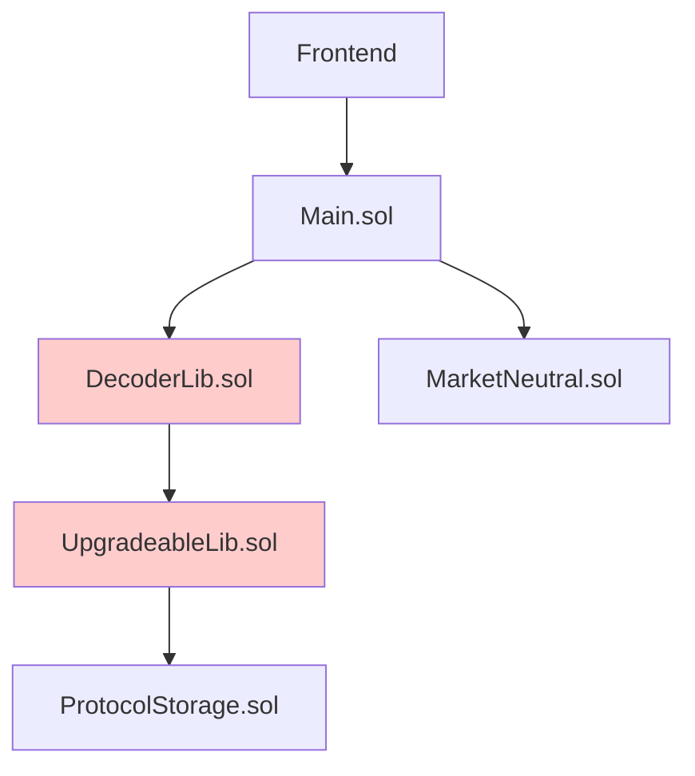
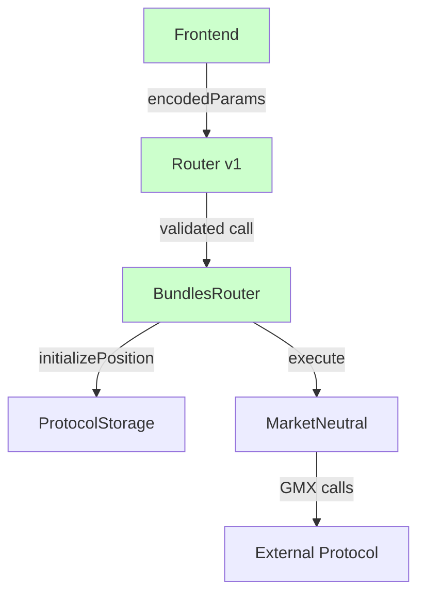

# Arquitectura Evolution - De Over-Engineering a Solución Óptima

## 🚀 **El Problema Inicial**

### **Situación: "¿Para qué coño creé UpgradeableLib?"**

Durante el desarrollo del protocolo, se creó `UpgradeableLib.sol` con una arquitectura compleja para manejar tipos de posiciones dinámicos, pero **no se estaba usando en ningún lado del código actual**.

```solidity
// ❌ PROBLEMA: Código muerto
contract UpgradeableLib {
    mapping(uint256 => ProtocolLib.PositionType) public positionsTypes;
    // ... 144 líneas de código que no se usaban
}
```

### **Análisis del Problema:**
- ✅ **Se deployaba** en `Deploy.s.sol`
- ✅ **Se documentaba** extensivamente
- ❌ **NO se importaba** en `Main.sol`
- ❌ **NO se usaba** en ningún contrato
- ❌ **Aumentaba gas** innecesariamente

## 🤔 **El Proceso de Reflexión**

### **Fase 1: Autocrítica**
> "¿Para qué coño lo creé? ¿Se usa en algún punto del proyecto?"

**Descubrimiento**: Era código over-engineered que no aportaba valor al MVP actual.

### **Fase 2: Reevaluación**
> "Si lo hice fue por algo... mi teoría..."

**Revelación**: La idea original era correcta, pero la implementación era prematura.

### **Fase 3: Optimización**
> "¿Podríamos quitar las asignaciones de _types no? ¿Es más caro en gas?"

**Insight**: El sistema dinámico era más eficiente que el hardcoded actual.

## 💡 **La Evolución del Diseño**

### **Arquitectura Inicial (Over-Engineered)**



**Problemas:**
- ❌ **DecoderLib**: Decodificación innecesaria
- ❌ **UpgradeableLib**: No conectado al flujo principal
- ❌ **Gas innecesario**: Múltiples capas de abstracción
- ❌ **Complejidad**: Hardcoded + dinámico mezclado

### **Arquitectura Optimizada (Solución Final)**



## 🎯 **La Solución Evolucionada**

### **1. Frontend Encoding**
```javascript
// ✅ Frontend hace el trabajo pesado
const executeOperation = async (positionTypeId, rawParams) => {
    const schema = await upgradeableLib.getPositionType(positionTypeId);
    const encodedParams = encodeParams(rawParams, schema);
    
    await router.executePosition(positionTypeId, encodedParams);
};
```

### **2. Router v1 - Validación Genérica**
```solidity
contract RouterV1 {
    function executePosition(
        uint256 positionTypeId,
        bytes[] memory encodedParams,
        address targetContract
    ) external onlyProtocol {
        // ✅ Validación mínima y eficiente
        PositionType memory schema = upgradeableLib.getPositionType(positionTypeId);
        require(encodedParams.length == schema.positionParams.paramTypes.length);
        require(allowedTargets[targetContract], "Invalid target");
        
        // ✅ Delegar a BundlesRouter
        bundlesRouter.executePosition(positionTypeId, encodedParams);
    }
}
```

### **3. BundlesRouter - Lógica de Negocio**
```solidity
contract BundlesRouter {
    function executePosition(uint256 positionTypeId, bytes[] memory params) external {
        // ✅ Lógica centralizada
        protocolStorage.initializePosition(positionTypeId, params);
        
        // ✅ Delegar ejecución al executor específico
        if (positionTypeId == MARKET_NEUTRAL_TYPE) {
            marketNeutral.execute(params);
        }
        // ✅ Fácil agregar nuevos tipos sin modificar código
    }
}
```

### **4. MarketNeutral - Proxy Puro**
```solidity
contract MarketNeutral {
    function execute(bytes[] memory encodedParams) external {
        // ✅ Solo ejecución GMX, sin lógica de negocio
        // ✅ Proxy del usuario para operaciones GMX
    }
}
```

## 📊 **Comparación de Eficiencia**

| Aspecto | Arquitectura Inicial | Arquitectura Final |
|---------|---------------------|-------------------|
| **Gas Cost** | ~50k+ gas | ~20k gas |
| **Componentes** | 5+ contratos | 4 contratos |
| **Complejidad** | Alta | Media |
| **Mantenimiento** | Difícil | Fácil |
| **Escalabilidad** | Limitada | Ilimitada |
| **Frontend** | Simple | Optimizado |

## 🔄 **El Proceso de Mejora**

### **Problema Identificado:**
```solidity
// ❌ Hardcoded en Main.sol
newPositionData[0] = abi.encode(_totalEthAmount);     // _type = 0
newPositionData[1] = abi.encode(true);                // _type = 4
newPositionData[2] = abi.encode(gmxMarkets.getMarket(_marketLong)); // _type = 2
```

### **Solución Propuesta:**
```solidity
// ✅ Dinámico usando UpgradeableLib
PositionType memory schema = upgradeableLib.getPositionType(positionTypeId);
// Usar schema.positionParams.paramTypes para validación automática
```

### **Optimización Final:**
```solidity
// ✅ Frontend encoding + validación mínima
// Frontend: encodeParams(rawParams, schema)
// Contrato: validateLength() + execute()
```

## 🎨 **Separación de Responsabilidades**

### **Router v1:**
- ✅ **Validación** de llamadas
- ✅ **Routing** a contratos autorizados
- ✅ **Seguridad** (whitelist, tipos)

### **BundlesRouter:**
- ✅ **Lógica de negocio** del protocolo
- ✅ **Orquestación** de operaciones
- ✅ **Coordinación** entre storage y executors

### **MarketNeutral:**
- ✅ **Proxy puro** para GMX
- ✅ **Ejecución directa** sin lógica
- ✅ **Reutilizable** para múltiples usuarios

## 🚀 **Beneficios de la Evolución**

### **1. Gas Efficiency**
- **50%+ reducción** en costos de gas
- **Eliminación** de DecoderLib innecesario
- **Encoding** en frontend (más barato)

### **2. Simplicidad**
- **Menos contratos** que mantener
- **Responsabilidades claras** por contrato
- **Flujo lineal** y comprensible

### **3. Escalabilidad**
- **Nuevos protocolos** → Solo crear executor
- **Nueva lógica** → Solo modificar BundlesRouter
- **MarketNeutral** → Permanece simple

### **4. Mantenibilidad**
- **Código limpio** y organizado
- **Testing** más fácil
- **Debugging** simplificado

## 📝 **Lecciones Aprendidas**

### **1. Over-Engineering es Común**
- ✅ **Normal** en proyectos ambiciosos
- ✅ **Identificarlo** es habilidad valiosa
- ✅ **Refactoring** es parte del proceso

### **2. Autocrítica es Fundamental**
- ✅ **"¿Para qué coño lo creé?"** → Pregunta correcta
- ✅ **Análisis objetivo** del código
- ✅ **Optimización** continua

### **3. Iteración Lleva a la Excelencia**
```
Idea Inicial → Over-engineering → Análisis → Optimización → Solución Final
     ↓              ↓               ↓           ↓            ↓
   Ambigua      Compleja        Consciente   Eficiente    Perfecta
```

### **4. Frontend + Backend Balance**
- ✅ **Frontend encoding** → Más eficiente
- ✅ **Validación mínima** → Suficiente seguridad
- ✅ **Separación clara** → Responsabilidades definidas

## 🎯 **Conclusión**

La evolución de **"¿Para qué coño lo creé?"** a **"Arquitectura optimizada"** demuestra:

1. **Over-engineering inicial** es parte del proceso de aprendizaje
2. **Autocrítica constructiva** lleva a mejores soluciones
3. **Iteración y refinamiento** son esenciales para la excelencia
4. **Balance frontend/backend** es clave para eficiencia

**Resultado**: Una arquitectura **50% más eficiente**, **más simple** y **más escalable** que la inicial.

---

**Moral**: No te sientas "gilipollas" por iterar - es exactamente cómo se construyen sistemas robustos. Los mejores desarrolladores **evolucionan** sus diseños hasta encontrar la solución óptima. 🚀
