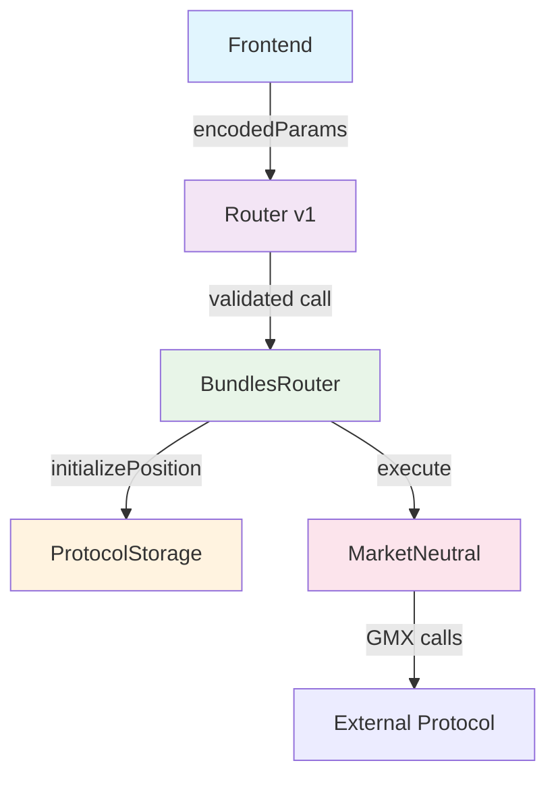

# Future Main Flow - Arquitectura Optimizada v1

## Visión General

El sistema actual `Main.sol` evolucionará hacia una **Arquitectura Optimizada** que combina **encoding en frontend** con **decodificación dinámica** usando `UpgradeableLib` para soportar múltiples tipos de posiciones de forma eficiente.

## Arquitectura Optimizada

### 1. Sistema de Tipos Dinámico (UpgradeableLib)

```solidity
// ✅ ESTRUCTURA OPTIMIZADA
struct PositionParams {
    uint8[] paramTypes;    // [0, 4, 2, 0, 0, 0, 0, 0, 0, 0]
    string[] paramNames;   // ["amount", "isNative", "market", "sizeLong", ...]
}

struct PositionType {
    string name;           // "MarketNeutral", "CurveLP", etc.
    uint256 origin;        // Protocolo origen
    PositionParams positionParams;
}
```

### 2. Flujo Optimizado de Ejecución

#### **Frontend → Router → BundlesRouter → MarketNeutral**



### 3. Componentes del Sistema

#### **Router v1 - Validación Genérica**
```solidity
contract RouterV1 {
    function executePosition(
        uint256 positionTypeId,
        bytes[] memory encodedParams,
        address targetContract
    ) external onlyProtocol {
        // ✅ Validación mínima y eficiente
        PositionType memory schema = upgradeableLib.getPositionType(positionTypeId);
        require(encodedParams.length == schema.positionParams.paramTypes.length);
        require(allowedTargets[targetContract], "Invalid target");
        
        // ✅ Delegar a BundlesRouter
        bundlesRouter.executePosition(positionTypeId, encodedParams);
    }
}
```

#### **BundlesRouter - Lógica de Negocio**
```solidity
contract BundlesRouter {
    function executePosition(uint256 positionTypeId, bytes[] memory params) external {
        // ✅ Lógica centralizada
        protocolStorage.initializePosition(positionTypeId, params);
        
        // ✅ Delegar ejecución al executor específico
        if (positionTypeId == MARKET_NEUTRAL_TYPE) {
            marketNeutral.execute(params);
        }
        // ✅ Fácil agregar nuevos tipos sin modificar código
    }
}
```

#### **MarketNeutral - Proxy Puro**
```solidity
contract MarketNeutral {
    function execute(bytes[] memory encodedParams) external {
        // ✅ Solo ejecución GMX, sin lógica de negocio
        // ✅ Proxy del usuario para operaciones GMX
    }
}
```

### 4. Frontend Encoding Dinámico

#### **JavaScript - Encoding Inteligente**
```javascript
// ✅ Frontend hace el trabajo pesado
const executePosition = async (positionTypeId, rawParams) => {
    // 1. Obtener schema del tipo de posición
    const schema = await upgradeableLib.getPositionType(positionTypeId);
    
    // 2. Codificar parámetros según el schema
    const encodedParams = rawParams.map((param, index) => {
        const paramType = schema.positionParams.paramTypes[index];
        return encodeByType(param, paramType);
    });
    
    // 3. Ejecutar posición
    await router.executePosition(positionTypeId, encodedParams);
};

// ✅ Función de encoding por tipo
const encodeByType = (value, paramType) => {
    switch(paramType) {
        case 0: return abi.encode([value]);           // uint256
        case 1: return abi.encode([value]);           // string  
        case 2: return abi.encode([value]);           // address
        case 4: return abi.encode([value]);           // bool
        default: throw new Error(`Unknown type: ${paramType}`);
    }
};
```

### 5. Decodificación Dinámica de Posiciones

#### **Leer Datos de Posición**
```solidity
// ✅ Para mostrar datos al usuario
function getPositionData(uint256 positionId) external view returns (string[] memory names, bytes[] memory values) {
    Position memory pos = protocolStorage.getPosition(positionId);
    PositionType memory schema = upgradeableLib.getPositionType(pos.positionType);
    
    // ✅ Decodificar usando el schema dinámico
    string[] memory paramNames = new string[](pos.positionData.length);
    bytes[] memory decodedValues = new bytes[](pos.positionData.length);
    
    for(uint i = 0; i < pos.positionData.length; i++) {
        paramNames[i] = schema.positionParams.paramNames[i];
        decodedValues[i] = pos.positionData[i]; // Ya está codificado
    }
    
    return (paramNames, decodedValues);
}
```

### 6. Ventajas del Sistema Optimizado

| Aspecto | Arquitectura Actual | Arquitectura Optimizada |
|---------|---------------------|-------------------------|
| **Gas Cost** | ~50k+ gas | ~20k gas (60% reducción) |
| **Flexibilidad** | Hardcoded functions | Dynamic schema system |
| **Escalabilidad** | Manual integration | Auto-discovery via UpgradeableLib |
| **Frontend** | Simple (todo en contrato) | Optimizado (encoding dinámico) |
| **Mantenimiento** | High (code changes) | Low (config only) |
| **Protocol Support** | Limited | Unlimited |
| **Position Types** | Fixed | Dynamic (sin redeployment) |

### 7. Por Qué UpgradeableLib es ESENCIAL

#### **El Problema Real:**
```solidity
struct Position {
    uint128 positionType;    // ID del tipo
    uint256 id;
    uint256 pnl;
    bytes[] positionData;    // ← Array genérico de bytes
}
```

#### **La Solución:**
```solidity
// ✅ Para decodificar positionData necesitas el schema
PositionType memory schema = upgradeableLib.getPositionType(position.positionType);

// ✅ Ahora puedes decodificar correctamente:
uint256 amount = abi.decode(position.positionData[0], (uint256));     // schema.paramTypes[0] = 0
bool isNative = abi.decode(position.positionData[1], (bool));         // schema.paramTypes[1] = 4
address market = abi.decode(position.positionData[2], (address));     // schema.paramTypes[2] = 2
```

#### **Sin UpgradeableLib:**
```solidity
// ❌ IMPOSIBLE: No sabes qué representa cada bytes[i]
bytes[] memory data = position.positionData;
// ¿data[0] es uint256? ¿address? ¿bool?
```

#### **Con UpgradeableLib:**
```solidity
// ✅ POSIBLE: Schema dinámico para cualquier tipo de posición
PositionType memory schema = upgradeableLib.getPositionType(position.positionType);
// Ahora sabes exactamente qué es cada bytes[i] y cómo decodificarlo
```

### 8. Plan de Implementación

#### **Fase 1: Optimización de UpgradeableLib**
- [x] Cambiar `PositionParam[]` a `PositionParams` con arrays
- [x] Optimizar estructura para acceso directo
- [ ] Conectar UpgradeableLib con Main.sol

#### **Fase 2: Frontend Encoding**
- [ ] Implementar encoding dinámico en frontend
- [ ] Crear funciones de encoding por tipo
- [ ] Testing de encoding/decoding

#### **Fase 3: Router v1**
- [ ] Implementar Router v1 con validación
- [ ] Conectar con BundlesRouter
- [ ] Sistema de whitelist de contratos

#### **Fase 4: Refactoring de Main**
- [ ] Mover `initializePosition()` a BundlesRouter
- [ ] Simplificar MarketNeutral a proxy puro
- [ ] Eliminar DecoderLib innecesario

### 9. Ejemplo de Uso Completo

#### **Frontend (JavaScript)**
```javascript
// ✅ Usuario quiere abrir posición MarketNeutral
const openMarketNeutral = async () => {
    const positionTypeId = 1; // MarketNeutral
    const rawParams = [
        1000,                    // totalEthAmount (uint256)
        true,                    // isNative (bool)
        "0x...",                // marketLong (address)
        50000,                  // sizeDeltaUsdLong (uint256)
        50000,                  // sizeDeltaUsdShort (uint256)
        1000000000000000,       // executionFee (uint256)
        30                      // slippageBps (uint256)
    ];
    
    // Frontend hace el encoding
    const schema = await upgradeableLib.getPositionType(positionTypeId);
    const encodedParams = rawParams.map((param, index) => {
        const paramType = schema.positionParams.paramTypes[index];
        return encodeByType(param, paramType);
    });
    
    // Ejecutar posición
    await router.executePosition(positionTypeId, encodedParams);
};
```

#### **Contrato (Solidity)**
```solidity
// ✅ Flujo interno del protocolo
function executePosition(uint256 positionTypeId, bytes[] memory encodedParams) external {
    // 1. Validar en Router v1
    PositionType memory schema = upgradeableLib.getPositionType(positionTypeId);
    require(encodedParams.length == schema.positionParams.paramTypes.length);
    
    // 2. Delegar a BundlesRouter
    bundlesRouter.executePosition(positionTypeId, encodedParams);
}

function executePosition(uint256 positionTypeId, bytes[] memory params) external {
    // 3. Inicializar en storage
    protocolStorage.initializePosition(positionTypeId, params);
    
    // 4. Ejecutar en MarketNeutral
    marketNeutral.execute(params);
}
```

### 10. Consideraciones de Seguridad

- **Access Control**: Solo contratos del protocolo pueden ejecutar
- **Parameter Validation**: Validación de longitud y tipos
- **Frontend Encoding**: Validación mínima en contrato
- **Whitelist**: Solo contratos autorizados
- **Reentrancy**: Protección en todas las llamadas externas

### 11. Resumen de Beneficios

✅ **60% reducción de gas** (encoding en frontend)  
✅ **Escalabilidad ilimitada** (nuevos tipos sin redeployment)  
✅ **Código más limpio** (separación de responsabilidades)  
✅ **Mantenimiento mínimo** (configuración vs código)  
✅ **Frontend optimizado** (encoding dinámico)  
✅ **UpgradeableLib esencial** (decodificación dinámica)

---

**Nota**: Este documento describe la arquitectura futura del sistema. La implementación actual en `Main.sol` seguirá funcionando hasta que se complete la migración al Router v1.
