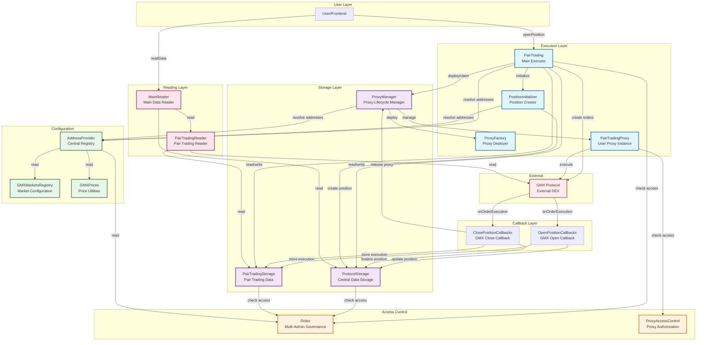

# Protocol

A decentralized protocol for pair trading strategies on GMX, enabling users to simultaneously open long and short positions across different markets to hedge against market risk.

## Overview

This protocol provides a sophisticated system for executing pair trading strategies on the GMX decentralized exchange. Users can deploy capital into simultaneous long and short positions, minimizing directional market exposure while capturing relative price movements between assets.

### Key Features

- **Pair Trading**: Execute simultaneous long and short positions on different GMX markets
- **Proxy System**: Gas-efficient proxy pool management for user position isolation
- **Real-time PnL Tracking**: Monitor position performance with up-to-date calculations
- **Flexible Collateral**: Support for both ETH and USDC as collateral tokens
- **Access Control**: Multi-admin governance system with democratic contract approval
- **Upgradeable Architecture**: Modular design with separation of concerns for maintainability

## Architecture

The protocol follows a modular architecture with clear separation between execution, storage, access control, and data reading layers.



## Core Components

### Execution Layer

- **PairTrading**: Main executor contract that handles pair trading position opening and closing. Supports both ETH and USDC collateral with slippage protection.
- **PositionInitializer**: Creates and initializes new positions in the protocol storage system.
- **ProxyFactory**: Deploys new PairTradingProxy instances when needed.
- **PairTradingProxy**: User-specific proxy instances that isolate positions and enable efficient gas usage.

### Storage Layer

- **ProtocolStorage**: Central storage for all user data, positions, and protocol statistics (TVL, total volume, PnL, etc.).
- **PairTradingStorage**: Specialized storage for pair trading execution data, raw GMX callback data, and position information.
- **ProxyManager**: Manages the lifecycle of proxy contracts, including pooling, deployment, and availability tracking.

### Access Control

- **Roles**: Multi-admin governance system requiring 2-of-3 admin consensus for contract approvals. Prevents single points of failure.
- **ProxyAccessControl**: Manages authorization for proxy contracts, ensuring only registered proxies can perform protocol operations.

### Configuration

- **AddressProvider**: Central registry storing addresses of all protocol contracts. Enables upgradeability and modularity.
- **GMXMarketsRegistry**: Configuration registry for GMX market addresses and identifiers.
- **GMXPrices**: Utility contract for fetching and calculating GMX prices with slippage calculations.

### Callback Handlers

- **OpenPositionCallbacks**: Handles GMX order execution callbacks when positions are opened, storing execution data and updating protocol state.
- **ClosePositionCallbacks**: Handles GMX order execution callbacks when positions are closed, finalizing positions and releasing proxies for reuse.

### Reading Layer

- **MainReader**: Primary interface for reading protocol data, user positions, and global statistics.
- **PairTradingReader**: Specialized reader for pair trading positions, calculating real-time PnL and position sizes.

## Technology Stack

- **Solidity**: ^0.8.28
- **Foundry**: Development, testing, and deployment framework
- **OpenZeppelin Contracts**: Security primitives (ReentrancyGuard, SafeERC20, etc.)
- **GMX Synthetics**: Integration with GMX protocol for leveraged trading

## Getting Started

### Prerequisites

- [Foundry](https://book.getfoundry.sh/getting-started/installation)
- Node.js (for optional tooling)
- Access to Arbitrum RPC endpoint

### Installation

```bash
# Clone the repository
git clone <repository-url>
cd protocol

# Install dependencies (via git submodules)
forge install

# Build contracts
forge build

# Run tests
forge test
```

### Configuration

1. Copy `.env_example` to `.env`
2. Fill in required environment variables:
   - `ADMIN1_PRIVATE_KEY`: Private key for admin deployment
   - `ETHERSCAN_API_KEY`: API key for contract verification

### Deployment

The protocol follows a specific deployment order:

1. **Core Infrastructure**: Roles → AddressProvider
2. **Storage**: ProtocolStorage, PairTradingStorage, ProxyManager
3. **Configuration**: GMXMarketsRegistry, GMXPrices
4. **Execution**: PairTrading, PositionInitializer, ProxyFactory
5. **Callbacks**: OpenPositionCallbacks, ClosePositionCallbacks
6. **Reading**: MainReader, PairTradingReader
7. **Access Control**: ProxyAccessControl

Use the deployment script:

```bash
forge script script/Deploy.s.sol:Deploy --rpc-url <rpc-url> --broadcast --verify
```

## Usage

### Opening a Pair Trading Position

Users call `PairTrading.openEtherPairTrading()` or `PairTrading.openUsdcPairTrading()` with:
- Total collateral amount
- Long and short market identifiers
- Position sizes in USD
- Slippage tolerance
- Execution fees

The contract:
1. Calculates acceptable prices with slippage
2. Initializes position data in storage
3. Divides collateral between long and short
4. Executes simultaneous orders on GMX
5. Stores position keys for tracking

### Closing a Position

Positions are closed through GMX callbacks when execution completes:
1. `ClosePositionCallbacks` receives execution data
2. Finalizes position in `ProtocolStorage`
3. Calculates and stores final PnL
4. Releases proxy for reuse via `ProxyManager`

### Reading Position Data

Use `MainReader` for accessing:
- User global statistics (total PnL, volume, positions)
- Active and closed position details
- Real-time PnL calculations
- Protocol-wide statistics

## Security

### Access Control

- **Multi-Admin Governance**: 3-administrator system requiring 2 approvals for contract registration
- **Protocol Contract Whitelisting**: Only approved contracts can modify protocol state
- **Proxy Authorization**: Separate access control for user proxy instances

### Security Features

- ReentrancyGuard on critical functions
- SafeERC20 for token transfers
- Input validation and slippage protection
- Proxy isolation to limit attack surface

### Audit Status

⚠️ **This protocol has not been audited yet. Use at your own risk.**

## Contributing

Contributions are welcome! Please ensure:

1. Code follows the existing style and patterns
2. All tests pass: `forge test`
3. New features include appropriate tests
4. Documentation is updated for significant changes

## License

This project is licensed under the MIT License - see the [LICENSE](LICENSE) file for details.

## Disclaimer

This software is provided "as is" without warranty of any kind. Use at your own risk. The developers assume no responsibility for any losses incurred from using this protocol.

## Contact

For questions, security issues, or collaboration inquiries, please open an issue in this repository.
