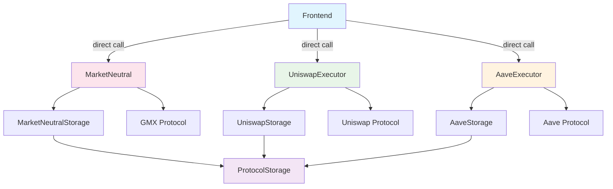

## 🏗️ Arquitectura V2

```mermaid
graph TD
    A[Frontend] -->|direct call| B[MarketNeutral]
    A -->|direct call| C[UniswapExecutor]
    A -->|direct call| D[AaveExecutor]
    
    B --> E[MarketNeutralStorage]
    C --> F[UniswapStorage]
    D --> G[AaveStorage]
    
    E --> H[ProtocolStorage]
    F --> H
    G --> H
    
    B --> I[GMX Protocol]
    C --> J[Uniswap Protocol]
    D --> K[Aave Protocol]
    
    style A fill:#e1f5fe
    style B fill:#fce4ec
    style C fill:#e8f5e8
    style D fill:#fff3e0
    style H fill:#f3e5f5
```